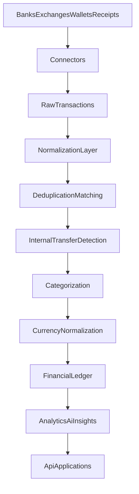

# Architecture

This document describes the **intended** architecture for Want Keep.

No application runtime exists in this repository yet. Treat the diagrams and contracts below as the target design, not as a description of shipped code.

## Goal

Want Keep should collect financial activity from banks, exchanges, wallets, receipts, and manual entry, then produce one consistent picture of a user's money.

> One place for all your money.

## Pipeline

```text
Banks / Exchanges / Wallets / Receipts
                  ↓
             Connectors
                  ↓
          Raw Transactions
                  ↓
        Normalization Layer
                  ↓
       Deduplication / Matching
                  ↓
       Internal Transfer Detection
                  ↓
          Categorization
                  ↓
      Currency Normalization
                  ↓
          Financial Ledger
                  ↓
      Analytics / AI Insights
                  ↓
         API / Applications
```



## Raw data vs domain entities

Keep two layers separate:

| Layer | Role |
| --- | --- |
| Raw external data | Provider payloads, receipt images, OCR output, webhook bodies |
| Normalized financial entities | Accounts, transactions, transfers, categories, balances, budgets |

The domain model must not depend on a bank-specific DTO. Map at the connector boundary, then work with Want Keep entities.

See [data-model.md](data-model.md).

## Connectors

Each external service should sit behind a shared connector contract: authenticate, refresh, fetch accounts, fetch balances, fetch transactions, sync, and optionally handle webhooks.

Connectors own provider quirks. The ledger does not.

See [integrations.md](integrations.md).

## Internal transfer detection

A movement between a user's own accounts is one transfer, not income plus expense.

```text
Account A
-10,000 RUB

Account B
+10,000 RUB
```

should be able to collapse to:

```text
Transfer
Account A → Account B
10,000 RUB
```

That transfer must not increase both:

```text
Expenses += 10,000
Income += 10,000
```

Detection may use amount, currency, timestamps, account ownership, descriptions, external identifiers, and known transfer metadata. Matching should stay conservative: uncertain pairs stay as separate transactions until they can be confirmed.

## Currency handling

Do not use floating-point types for money.

The implementation should use decimal/fixed precision or integer minor units, depending on the future stack. Store the original amount and currency separately from any converted value:

```text
originalAmount
originalCurrency
```

Historical transactions should use the exchange rate for that period, not necessarily the current rate.

## OCR

```text
Image
  ↓
Preprocessing
  ↓
OCR
  ↓
Structured Extraction
  ↓
Merchant / Date / Total / Items
  ↓
Confidence Validation
  ↓
Transaction Matching
```

OCR may suggest a transaction. It must not automatically create a confirmed financial operation when confidence is low and the user has no review path.

## AI

AI is an enhancement layer, not the source of truth.

> Deterministic financial calculations must not depend on LLM output.

LLMs may help with summaries, categorization suggestions, anomaly explanations, merchant normalization, natural-language queries, and insights.

These values must be calculated in deterministic code:

- balances
- transaction amounts
- exchange calculations
- accounting logic
- daily budget calculations

## Applications

API and client applications should read from the normalized ledger and insight layer. They should not bypass connectors to persist provider-specific records as if they were domain entities.

## Privacy posture

The intended posture is local-first, privacy-first, and self-hosting-friendly where that is reasonable.

See [security.md](security.md) and [self-hosting.md](self-hosting.md).
