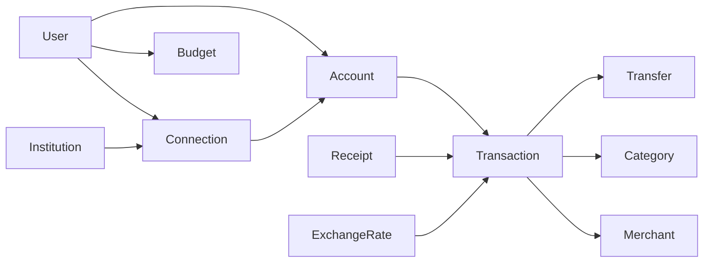

# Data model

This document describes the **intended** domain model.

It is not a SQL schema and not an implemented persistence layer. Keep the first version small. Add fields when a real use case needs them.

## Design rules

- Model the user's finances, not a provider payload.
- Keep raw external data referenced, not embedded as the domain type.
- Do not use floating-point types for money. Use decimal/fixed precision or integer minor units, depending on the future stack.
- Store `originalAmount` and `originalCurrency` separately from any converted value.
- Historical conversion should use the rate for that period.

## Core entities

```text
User
Account
Institution
Connection
Transaction
Transfer
Category
Merchant
Receipt
ReceiptItem
Currency
ExchangeRate
Budget
FinancialSnapshot
Insight
```



### User

The person who owns the data. Holds preferences such as base currency and, later, budget settings.

### Institution

A bank, exchange, wallet, or other financial service. This is the catalog entry, not a live login.

### Connection

A user's authenticated link to an institution. Owns auth state, sync cursors, and connector metadata. Credentials must stay out of source control and out of domain logs.

### Account

A balance-bearing container: bank account, card, wallet, exchange balance, or manual account.

### Transaction

A single normalized money movement on one account.

A transaction should be able to store:

- external id
- source
- account
- amount
- currency
- normalized amount
- base currency
- date
- merchant
- category
- description
- transaction type
- original raw data reference
- transfer relation
- sync metadata

`amount` / `currency` are the original values. `normalizedAmount` / `baseCurrency` are derived from a dated exchange rate.

### Transfer

A link between two transactions that represent one internal movement.

```text
Account A → Account B
10,000 RUB
```

Income and expense totals should ignore both legs once they are linked.

### Category

A user-facing spending or income category. Suggestions may come from rules or AI. The confirmed category is a domain decision, not an LLM output.

### Merchant

A normalized payee or payer. Receipt OCR and provider descriptions may both point here after matching.

### Receipt and ReceiptItem

OCR output and, later, a user-confirmed receipt. Line items are optional. Low-confidence extraction must not become a confirmed transaction by itself.

### Currency and ExchangeRate

ISO currency codes plus dated rates used for historical conversion.

### Budget

A planned limit over a period, usually by category or as a daily/monthly envelope.

### FinancialSnapshot

A computed view of balances or cash flow at a point in time. Snapshots should be derived from the ledger, not typed in by an LLM.

### Insight

A generated explanation or recommendation attached to ledger facts. Insights can be wrong; the underlying amounts cannot be invented by the model.

## Internal transfers

Two opposite transactions on accounts owned by the same user may become one `Transfer`.

Matching may consider amount, currency, timestamps, ownership, descriptions, external identifiers, and provider transfer metadata. Uncertain pairs stay unlinked.

## What not to model yet

Do not turn this list into a fully normalized warehouse before the first ledger exists. Skip speculative entities such as multi-tenant billing, marketplace catalogs, or provider-specific product trees until there is code that needs them.
