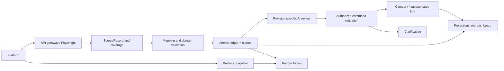
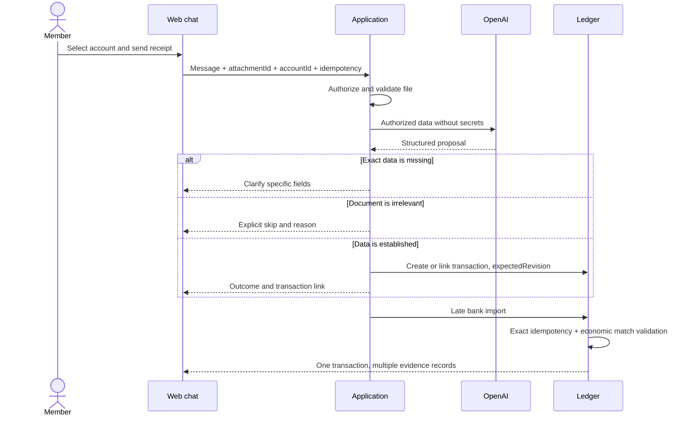
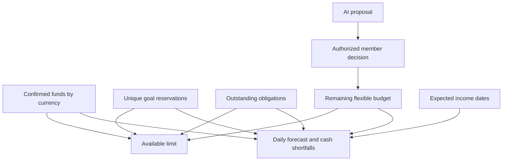
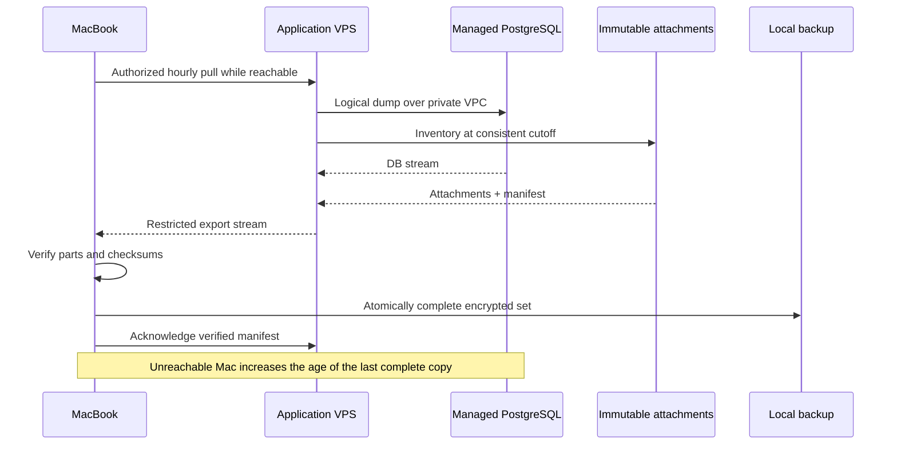
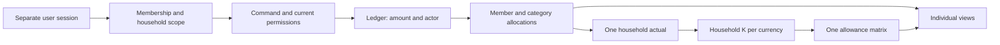
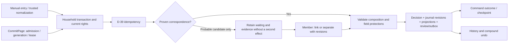
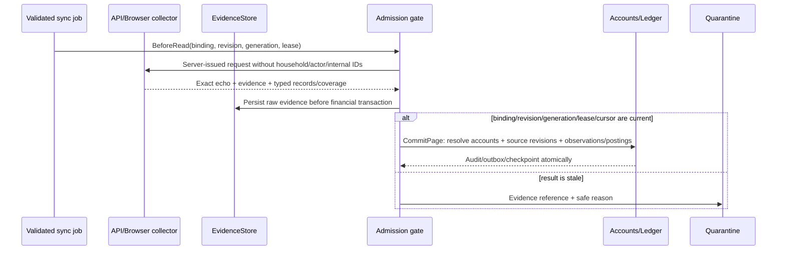

# Data flows

[Русский](flows.md)

## Import and AI review

Retain SourceRecord even with incomplete mapping. Ledger operations can continue while AI waits; unknown financial values do not post. The dashboard separately shows source freshness, coverage and AI-review status.

## Receipt and late import

Equal amounts/times yield candidates, not uniqueness proof. Multiple purchases require clarification. A transaction change while AI responds makes the old proposal inapplicable.

## Plan and daily allowance

Received income changes actuals; a planned date does not create money. A fulfilled payment releases the corresponding reserved obligation.

## Mac backups

A partial set never replaces the last complete backup. Recovery keys must remain available outside the sole failed system. Retention is 48 hourly, 30 daily, 8 weekly and 12 monthly points within a 20 GiB cap; never delete the last complete set. The one-hour RPO depends on Mac availability and set verification. Restoring an old set into clean managed PostgreSQL does not automatically activate old bank sessions. Full contract and open runtime gates: [hosting evidence](evidence/hosting.en.md).

## Household permissions and views

## Task-2.4: from facts to one effect

Original statuses and dates remain in history. Incomplete search and waiting produce matching_unresolved; source observations stay separate. Stale import jobs enter quarantine before this flow. Bank IO and document recognition are connected by their owning tasks.

## Task-3.2: connector ingestion page

A page is self-contained: every supported account used by a balance or posting has an account descriptor on that page. A later page repeats the descriptor and prior cursor; replay creates no account/opening/financial effect. Failure on page two never advances its cursor, while the confirmed first page stays committed with partial coverage.
