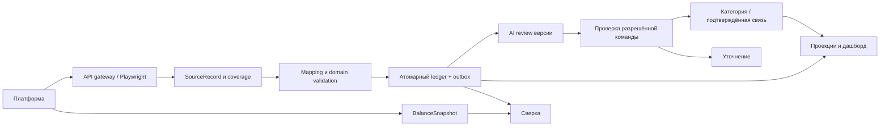
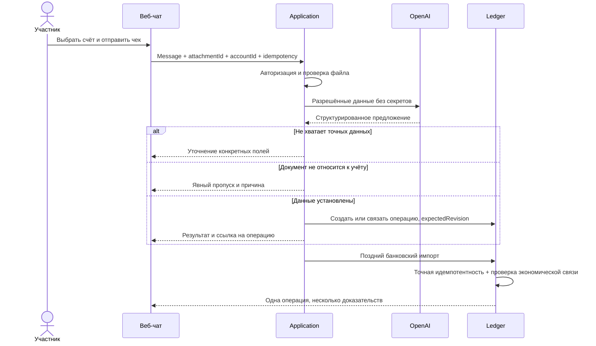
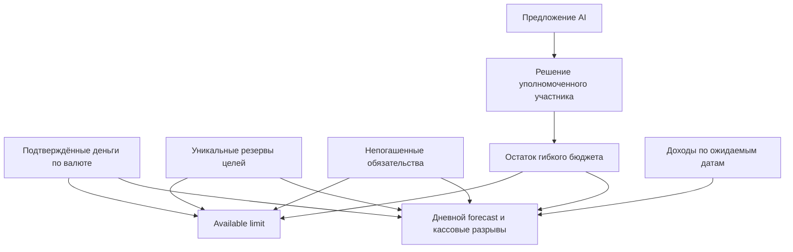
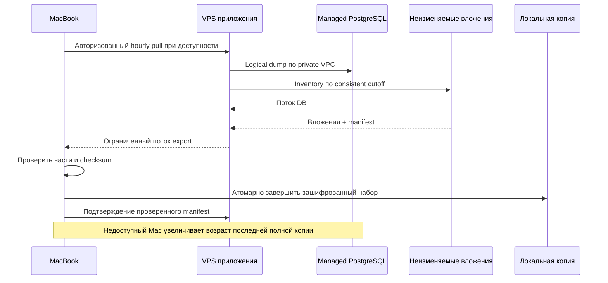
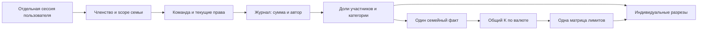
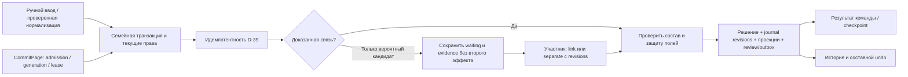
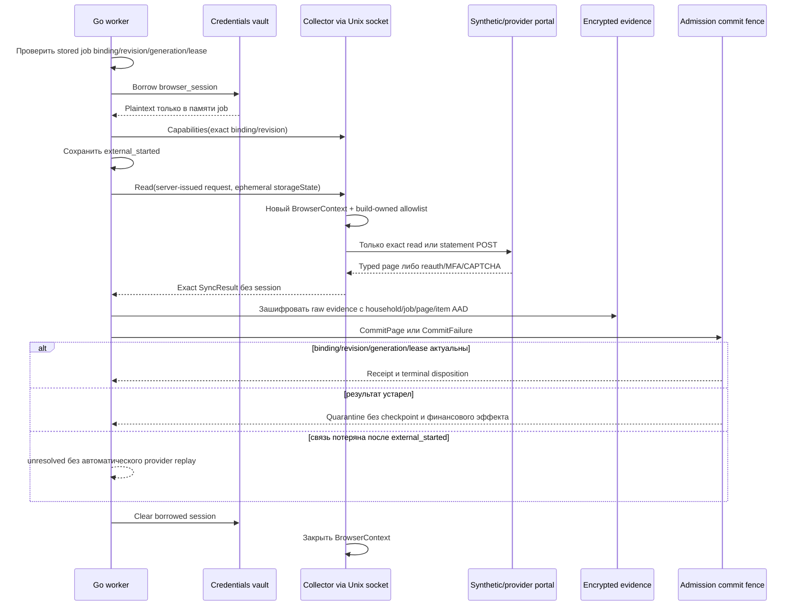

# Потоки данных

[English](flows.en.md)

## Импорт и AI-проверка



SourceRecord сохраняется и при неполном mapping. Ledger может работать, пока AI ждёт; неустановленные финансовые значения не проводятся. У дашборда отдельные признаки свежести источника, покрытия и AI-review.

## Чек и поздний импорт



Равные сумма и время формируют кандидатов, не доказательство единственности. Если найдено несколько покупок, требуется уточнение. Изменение операции во время ответа AI делает старое предложение неприменимым.

## План и дневной лимит



Получение дохода меняет факт; наступление плановой даты само по себе не создаёт деньги. Погашенный платёж снимает соответствующую резервируемую часть обязательства.

## Резервирование на Mac



Последняя полная копия не заменяется незавершённой. Recovery-ключ должен быть доступен вне единственной аварийной системы. Retention: 48 почасовых, 30 дневных, 8 недельных и 12 месячных точек при cap 20 GiB; последний полный набор не удаляется. RPO до часа условен доступностью Mac и проверкой набора. Восстановление старого набора в чистый managed PostgreSQL не активирует старые банковские сессии автоматически. Подробный контракт и открытые runtime gates: [hosting evidence](evidence/hosting.md).

## Семейные права и разрезы



## Task-2.4: от факта к одному эффекту



Отдельные исходные статусы и даты остаются в истории. Неполный поиск и ожидание дают matching_unresolved; source observations сохраняются отдельно. Устаревший import job попадает в quarantine до этой цепочки. Банковский IO и распознавание документов подключаются в профильных задачах.

## Task-3.2: входная страница коннектора

```mermaid
sequenceDiagram
  participant J as Проверенное sync job
  participant C as API/Browser collector
  participant E as EvidenceStore
  participant G as Admission gate
  participant A as Accounts/Ledger
  participant Q as Quarantine
  participant R as Restart reconciler
  J->>G: Проверить exact gateway binding
  J->>G: BeforeRead(binding, revision, generation, lease)
  G->>C: Server-issued request без household/actor/internal IDs
  C-->>G: Exact echo + issued cursor + evidence + typed records/coverage
  G->>E: Сохранить raw evidence с server-derived household/job и disposition=staged
  alt provider failure
    G->>Q: Связать evidence с household/job
    G->>G: Атомарно сохранить waiting/retry/failed
  else binding/revision/generation/lease/cursor актуальны
    G->>A: CommitPage: resolve accounts + source revisions + observations/postings
    A-->>G: Audit/outbox/checkpoint + immutable receipt атомарно
    opt Подтверждение commit потеряно
      G->>G: Readback receipt; без доказательства оставить staged
    end
    opt account/source ambiguity
      A->>Q: Evidence + source_ambiguous/transaction_unresolved
      A-->>G: Partial coverage без неподтверждённого эффекта
    end
  else page отклонена после staging
    G->>Q: Durable retention через отдельный lifecycle context
    Q-->>G: Только успех переводит staged в rejected_result
  else результат устарел
    G->>Q: Evidence reference + safe reason
  end
  opt После рестарта disposition остался staged
    R->>E: Прочитать staged batches
    R->>G: Найти terminal receipt по household/job/evidence
    G-->>R: page/provider_outcome/rejected_result/stale_result либо неизвестно
    R->>E: Идемпотентно завершить только доказанный disposition
  end
```

Страница самостоятельна: каждый поддерживаемый счёт, используемый balance или posting, имеет account descriptor в той же странице. Следующая страница повторяет descriptor и исходный cursor; повтор не создаёт account/opening/financial effect. `nextCursor` либо отсутствует, либо непустой. Provider failure также повторяет issued cursor; sync-result boundary отклоняет запоздалый outcome прежней страницы, а общая lease identity продолжает heartbeat после продвижения checkpoint. Ошибка второй страницы не продвигает её cursor, а уже подтверждённая первая страница остаётся зафиксированной с partial coverage. Совокупный набор gaps после объединения с checkpoint ограничен 100 значениями; переполнение откатывает страницу. Неоднозначный счёт или source не превращает страницу в полный успех и не отменяет независимые поддержанные записи. Подтверждённый provider mapping `RUR → RUB` сохраняет raw code в evidence/metadata и использует RUB в финансовом домене. Повтор с новым evidence ID/locator, эквивалентными пустыми optional-полями и тем же нормализованным payload/raw digest не создаёт source revision. Evidence использует канонический base64 без CR/LF. Неизвестный результат commit подтверждается только атомарной receipt; без неё evidence остаётся staged. Restart reconciler завершает disposition только по сохранённой terminal receipt и не повторяет финансовый эффект.

## Task-3.3: browser job



Collector не получает actor, household permission, произвольный маршрут или browser script. Вход пользователя в кабинет и provider-specific workflow добавляются task-4.x. Production egress и runtime admission подтверждает task-8.x.
