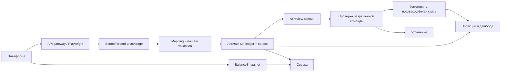
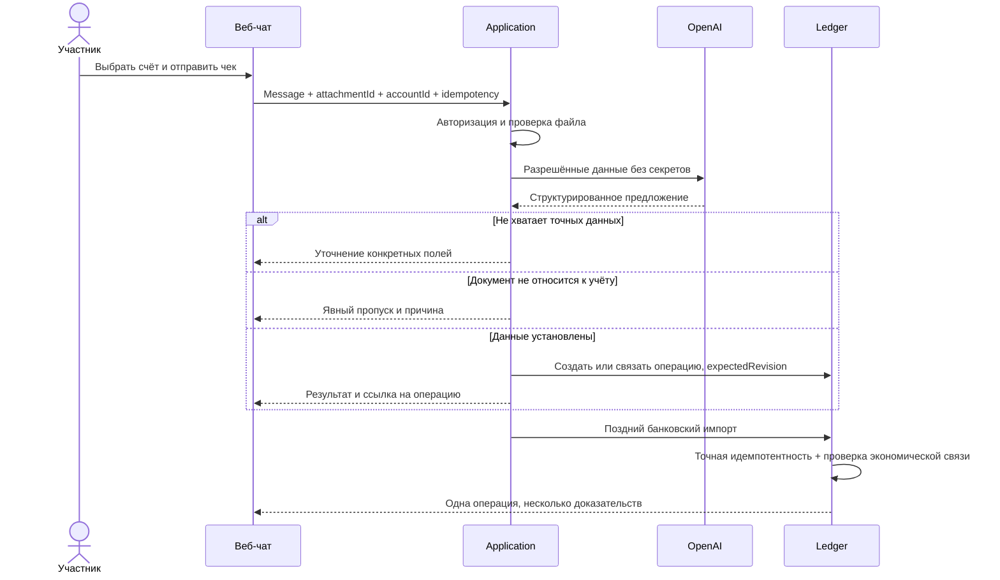
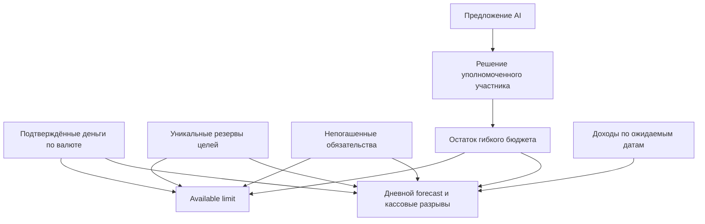
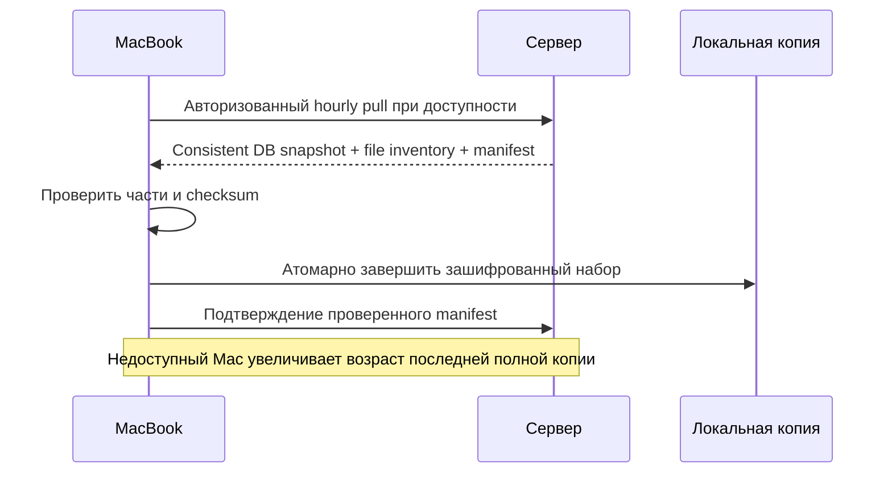
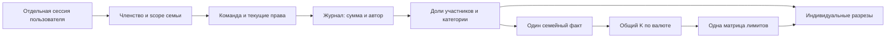

# Потоки данных

[English](flows.en.md)

## Импорт и AI-проверка

SourceRecord сохраняется и при неполном mapping. Ledger может работать, пока AI ждёт; неустановленные финансовые значения не проводятся. У дашборда отдельные признаки свежести источника, покрытия и AI-review.

## Чек и поздний импорт

Равные сумма и время формируют кандидатов, не доказательство единственности. Если найдено несколько покупок, требуется уточнение. Изменение операции во время ответа AI делает старое предложение неприменимым.

## План и дневной лимит

Получение дохода меняет факт; наступление плановой даты само по себе не создаёт деньги. Погашенный платёж снимает соответствующую резервируемую часть обязательства.

## Резервирование на Mac

Последняя полная копия не заменяется незавершённой. Recovery-ключ должен быть доступен вне единственной аварийной системы. Восстановление старого набора не активирует старые банковские сессии автоматически.

## Семейные права и разрезы

