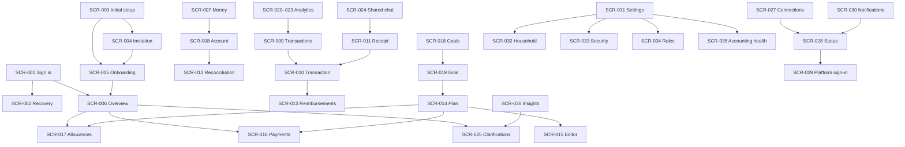

# Desktop navigation and flows

[Русский](navigation.md) · [SCR-001–SCR-035 catalog](screens.en.md) · [Design](design.en.md)

REQ-055, REQ-080–REQ-085, AC-055/AC-097–AC-102; task-7.1–task-7.14. The screen catalog contains each SCR’s full structure, forms, permissions, states and local transitions. Shared navigation rules follow.

## Shell

| Level | Purpose |
| --- | --- |
| Top | Current screen title/context; SCR-030 notifications and current user. Financial filters appear only where they affect the answer. |
| Left menu | Overview SCR-006; Money SCR-007 (accounts, transactions, reimbursements); Plan SCR-014 (month, calendar, allowances, goals); Analytics SCR-020 (income/expense, returns, crypto, rates, insights); Chat SCR-024 (shared, clarifications). |
| Lower menu | Connections SCR-027 and Settings SCR-031. Accounting health SCR-035 is reachable through settings and problem notifications. |
| Content | Answer first, then action, explanation and details. One primary CTA per meaningful block. |

Default route after sign-in is `/overview`, except unfinished mandatory passkey/membership creation. SCR-005 allows continuing with available accounts and returning to remaining steps later. After reauthentication, a safe internal deep link resumes for the same user with a fresh permission check. External return URLs are rejected.

At 1280×720 and 1440×900 the menu stays on the left; smaller windows/200% zoom may use a compact rail with a labelled expand button. This is desktop navigation, not a mobile bottom bar. Content adjusts columns to leave space for forms. Labels remain available in expanded navigation and to assistive technology; tooltip never replaces the accessible name.

## Context and details

Report/list URLs retain nonsecret period/month, view/member, currency, account/category, query and sort. Never put receipts, secrets, messages or financial drafts in URLs. Cursor/list position restores from navigation state on return; if data changed, show refreshed rows with preserved filters. Member selection changes presentation only, never principal or authority.

SCR-008/010/011/019 may open in a side panel over a list while retaining a direct route. Direct navigation/reload renders a full view with clear return. Closing panel/Back restores list, filters and focus to the origin row. Opening successive details never stacks panels; substantial editing uses a page. Short finished actions use dialogs: correction confirmation, disconnect or device revocation. No nested dialogs.

Unsaved forms warn before leaving; cancelling keeps current-tab input. Session expiry hides financial contents. An in-memory draft resumes only after the same member signs in; logout or another identity clears it. Unknown save outcomes reconcile the command first. Direct URLs never bypass server permissions; expired invitations never open the household, and partner personal goals remain viewable without edit permission.

## Key routes

## Acceptance without developer assistance

| Flow | Route and observable outcome |
| --- | --- |
| Daily budget | SCR-006 → SCR-017 → SCR-016: name available native-currency allowance and first shortfall date; distinguish forecast. |
| Explain amount | SCR-006 → explanation → SCR-009/010: reconstruct the amount and understand transfer/reserve exclusion. |
| Receipt | SCR-024 → FORM-07 → SCR-011/010: select account, clarify, state “created” or “found” without duplicate expense. |
| Shared expense | SCR-010 → FORM-07/06: change shares, verify personal totals and one household payment. |
| Goal | SCR-019 → FORM-11 preview → SCR-017: explain reserve impact on free money without a second reservation. |
| Incomplete data | SCR-006/030 → SCR-028/029 or SCR-025: identify required reauth owner or AI wait reason and available ordinary accounting. |
| Access | SCR-001 → SCR-002 → SCR-006: sign in and recover own access only in actual Chrome and Arc. |

UX outcomes follow AC-102; a successful click-through without correct understanding of amounts does not satisfy the criterion.
