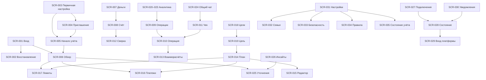

# Навигация и сценарии desktop

[English](navigation.en.md) · [Каталог SCR-001–SCR-035](screens.md) · [Дизайн](design.md)

REQ-055, REQ-080–REQ-085, AC-055/AC-097–AC-102; task-7.1–task-7.14. Полная структура, формы, права, состояния и локальные переходы каждого SCR находятся в каталоге экранов. Ниже — общие правила переходов.

## Оболочка

| Уровень | Назначение |
| --- | --- |
| Верх | Название текущего экрана, его контекст; уведомления SCR-030 и текущий пользователь. Финансовые фильтры только там, где влияют на ответ. |
| Левое меню | Обзор SCR-006; Деньги SCR-007 (счета, операции, взаиморасчёты); План SCR-014 (месяц, календарь, лимиты, цели); Аналитика SCR-020 (расходы/доходы, доходность, крипто, курсы, инсайты); Чат SCR-024 (общий, уточнения). |
| Низ меню | Подключения SCR-027 и Настройки SCR-031. Состояние учёта SCR-035 доступно из настроек и уведомлений о проблемах. |
| Контент | Сначала ответ на вопрос; затем действие, объяснение и детализация. Один основной CTA на смысловой блок. |

Начальный маршрут после входа — `/overview`, кроме незавершённого обязательного создания passkey/членства. SCR-005 можно продолжить с уже доступными счетами и вернуться к остальным шагам позже. Разрешённый внутренний deep link после повторного входа восстанавливается для того же пользователя с новой проверкой прав. Внешний return URL не принимается.

На 1280×720 и 1440×900 меню постоянно слева; при уменьшении окна/200% zoom допускается его компактный rail с подписанной кнопкой раскрытия. Это desktop-навигация, не нижнее мобильное меню. Контент перестраивает число колонок, освобождая ширину формам. Текстовые labels доступны в раскрытом меню и assistive technology; tooltip не заменяет доступное имя.

## Контекст и детали

URL отчётов/списков хранит несекретные period/month, view/member, currency, account/category, query и сортировку. Не помещать в URL чеки, секреты, сообщения или финансовый черновик. Курсор/позиция списка восстанавливаются из состояния навигации при возврате; если данные изменились, показать обновлённый список и сохранить фильтры. Выбор участника меняет только представление, не principal или доступ.

SCR-008/010/011/019 могут открываться боковой панелью поверх списка, сохраняя прямой маршрут. Прямой переход/перезагрузка того же URL открывает полноценное представление с понятным возвратом. Закрытие панели/Back восстанавливает список, фильтры и фокус на исходной строке. Последовательное открытие деталей не создаёт стопку панелей; крупное редактирование открывает страницу. Короткие законченные действия используют dialog: подтверждение исправления, отключение подключения, отзыв устройства. Вложенные dialogs исключены.

Несохранённая форма предупреждает при уходе; отмена сохраняет ввод в текущей вкладке. После session expiry финансовое содержимое закрывается. Черновик можно продолжить в памяти только после входа того же участника; logout или другой пользователь очищает его. Сохранение неизвестного результата сначала сверяет команду. Прямой URL не обходит серверные права, просроченное приглашение не открывает семью, чужая личная цель доступна для просмотра без права её менять.

## Ключевые маршруты

## Сценарии приёмки без помощи разработчика

| Сценарий | Маршрут и наблюдаемый результат |
| --- | --- |
| Дневной бюджет | SCR-006 → SCR-017 → SCR-016: назвать доступный лимит в исходной валюте и дату первого дефицита; отличить прогноз. |
| Объяснение суммы | SCR-006 → объяснение → SCR-009/010: воспроизвести состав суммы и понять исключение перевода/резерва. |
| Чек | SCR-024 → FORM-07 → SCR-011/010: выбрать счёт, ответить на вопрос, сказать «создано» или «найдено», без повторного расхода. |
| Совместный расход | SCR-010 → FORM-07/06: поменять доли, проверить личные итоги и один семейный платёж. |
| Цель | SCR-019 → FORM-11 preview → SCR-017: объяснить влияние резерва на свободные деньги, без второй резервации. |
| Неполные данные | SCR-006/030 → SCR-028/029 или SCR-025: понять нужного владельца reauth либо причину ожидания AI и доступность обычного учёта. |
| Доступ | SCR-001 → SCR-002 → SCR-006: войти и восстановить только собственный доступ в реальных Chrome и Arc. |

Результат UX фиксируется по AC-102; успешный click-through без верного понимания сумм не закрывает критерий.
